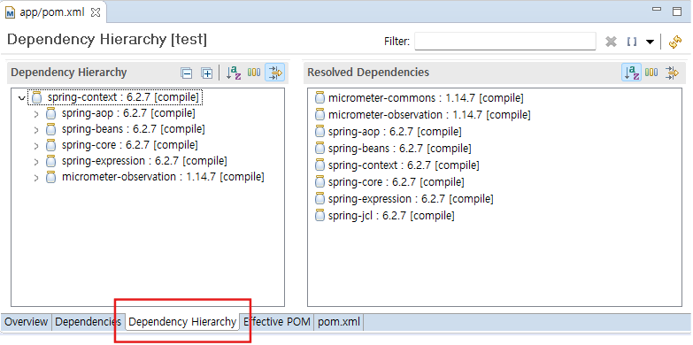

### 강의

| 일  | 수업         |
| :-- | :----------- |
| 1   | DI           |
| 2   | AOP          |
| 3   | MyBatis      |
| 4   | JPA          |
| 5   | MVC          |
| 6   | 실습-게시판  |
| 7   | REST API     |
| 8   | 실습-댓글    |
| 9   | 개인프로젝트 |
| 10  | springboot   |
| 11  | ThymeLeaf    |
| 12  | security     |
| 13  | 개인프로젝트 |
| 14  | eGovFrame    |
| 15  | eGovFrame    |
| 16  | 시험         |

### 스프링을 왜 쓰는가?

- Microservices
- Reactive
- Event Driven
- Cloud
- Web Applications
- Serverless
- Batch

### 스프링 웹 애플리케이션 개발

- 스프링 프레임워크
- 스프링 데이터
- Mybatis
- 스프링 시큐리티
- 스프링 배치
- 서버사이트템플릿엔진( Thymeleaf )

### 스프링 프레임워크

- DI
- AOP
- MVC
- JDBC



### 개발환경

#### STS

- https://spring.io/tools

spring-tools-for-eclipse-4.30.0.RELEASE-e4.35.0-win32.win32.x86_64.zip

#### Lombok

https://projectlombok.org/setup/maven

```shell
> cd C:\Users\admin\.m2\repository\org\projectlombok\lombok\1.18.38
> java -jar lombok-1.18.38.jar
```

eclipse.ini

```
-javaagent:D:\sts-4.30.0.RELEASE\lombok.jar
```

#### pom.xml

```xml
<project xmlns="http://maven.apache.org/POM/4.0.0"
	xmlns:xsi="http://www.w3.org/2001/XMLSchema-instance"
	xsi:schemaLocation="http://maven.apache.org/POM/4.0.0 https://maven.apache.org/xsd/maven-4.0.0.xsd">
	<modelVersion>4.0.0</modelVersion>
	<groupId>com.yedam</groupId>
	<artifactId>app</artifactId>
	<version>0.0.1-SNAPSHOT</version>
	<dependencies>
		<!--
		https://mvnrepository.com/artifact/org.springframework/spring-context -->
		<dependency>
			<groupId>org.springframework</groupId>
			<artifactId>spring-context</artifactId>
			<version>6.2.7</version>
		</dependency>
		<dependency>
			<groupId>org.projectlombok</groupId>
			<artifactId>lombok</artifactId>
			<version>1.18.38</version>
			<scope>provided</scope>
		</dependency>
	</dependencies>
	<build>
		<plugins>
			<plugin>
				<groupId>org.apache.maven.plugins</groupId>
				<artifactId>maven-compiler-plugin</artifactId>
				<configuration>
					<annotationProcessorPaths>
						<path>
							<groupId>org.projectlombok</groupId>
							<artifactId>lombok</artifactId>
							<version>1.18.38</version>
						</path>
					</annotationProcessorPaths>
				</configuration>
			</plugin>
		</plugins>
		<resources>
			<resource>
				<directory>src/main/java</directory>
				<includes>
					<include>**/*.xml</include>
				</includes>
			</resource>
		</resources>
	</build>
</project>
```
