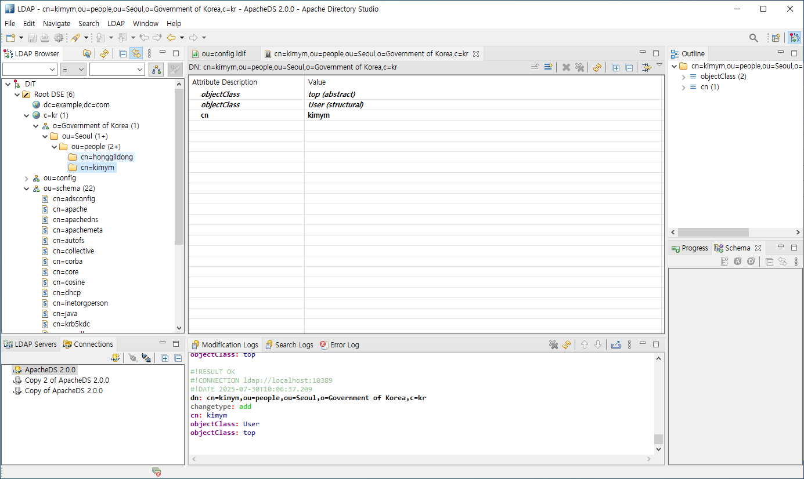
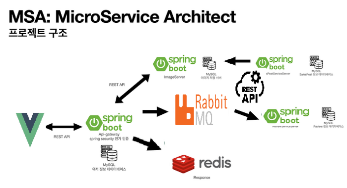

## MSA

- Mircro Service Architecture
- 애플리케이션을 느슨하게 결합된 서비스의 모임으로 구조화 하는 소프트웨어 아키텍쳐 스타일
- 각 서비스들이 독립적으로 배포,실행되고 서로 통신은 하지만 문제가 생겼을 때 서로 크게 영향을 받지 않는 유연한 서비스 구조
  

### 모놀리스 스케일아웃

### 마이크로 서비스 스케일 아웃

### 마이크로서비스 팀구성

- 서비스는 소규모 팀이 (two pizza : 6–10명) 개발하고 테스트할 수 있을 만큼 작아야 함
- 각 팀은 자율적이어야 하고 다른 팀과 최소한의 협업을 통해 서비스를 개발하고 배포하여야 함
- OOD(Object Oriented Design), SRP(Single Resposibility Priciple),
  CCP(Common Closure Principle)
- 새롭고 변경된 요구 사항이 단일 서비스에만 영향을 미치도록 분해함
- 각 서비스는 구현을 캡슐화하는 API로 느슨하게 결합되어야 함
- 클라이언트에 영향을 주지 않고 구현을 변경해야 함
- 각 서비스는 단위 테스트 가능해야 함

### 마이크로서비스 구성도



### MSA의 구성 요소와 Spring Cloud 기술

- 서비스 로직(마이크로 서비스) --> 각각의 스프링 부트 프로젝트
- 게이트웨이 --> Spring Cloud Gateway
- 서비스 검색 --> Spring Cloud Discovery(Netflix Eureka)
- 변수(구성정보)관리 서버 --> Spring Cloud Config
- 마이크로서비스 간의 통신 --> Spring Cloud Routing(OpenFeign(동기방식))  
   Spring Cloud Messaging(RabbitMQ(비동기방식))

### 실습

```
spring.rabbitmq.host=rabbitmq
spring.rabbitmq.port=5672
spring.rabbitmq.username=myuser
spring.rabbitmq.password=1234
```

```shell
$ docker network create msa-net
$ docker run -it --rm --name rabbitmq --network msa-net -p 5672:5672 -p 15672:15672 rabbitmq:4-management

rabbitmqctl add_user myuser 1234
rabbitmqctl set_user_tags myuser administrator
rabbitmqctl set_permissions -p / myuser ".*" ".*" ".*"


docker build -t app/mq1  .
docker exec -it myapp-debug bash


$ ./gradlew bootBuildImage --imageName=app/mq1 --builder paketobuildpacks/builder:base
$ docker run --name app1 --network msa-net -p7077:7077  rabbitmq1:0.0.1-SNAPSHOT
$ docker run --name app1 --network msa-net -p7077:7077  -e SPRING_RABBITMQ_HOST=rabbitmq  -e SPRING_RABBITMQ_PORT=5672 -e SPRING_RABBITMQ_USERNAME=myuser -e SPRING_RABBITMQ_PASSWORD=1234  rabbitmq1:0.0.1-SNAPSHOT
$ docker run --name mq1 --network msa-net -p7077:7077  app/mq1

$ ./gradlew bootBuildImage --imageName=app/mq2 --builder paketobuildpacks/builder:base
$ docker run --name mq2 --network msa-net -p7078:7078  app/mq2


docker exec -it insa ping rabbitmq
docker exec -it insa curl rabbitmq:5672

docker network inspect msa-net


```

spring.rabbitmq.host=rabbitmq

docker exec -it mq1 env | grep SPRING_RABBITMQ

-e SPRING_RABBITMQ_HOST=rabbitmq -e SPRING_RABBITMQ_PORT=5672 -e SPRING_RABBITMQ_USERNAME=myuser -e SPRING_RABBITMQ_PASSWORD=1234

-e SPRING_RABBITMQ_HOST=rabbitmq  
 -e SPRING_RABBITMQ_PORT=5672
-e SPRING_RABBITMQ_USERNAME=guest
-e SPRING_RABBITMQ_PASSWORD=guest

D:\gitwork\spring_springboot\rabbitmq2
