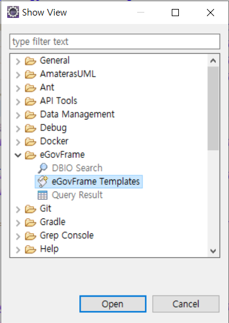
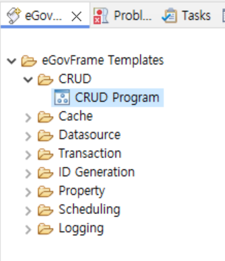

## [eGovFrame](https://www.egovframe.go.kr/home/main.do)

### 설치
1. 다운로드 -> 개발환경 -> 4.x 다운로드 > 개발자용 개발환경 for Windows 64bit (Implementation Tool) Version 4.3.0 첨부파일 다운받기  
2. eGovFrameDev-4.3.0-64bit.zip 파일 C:\ 에 하위폴더 생성 체크해서 압축해제하기  

```
c:\
  ┗━ eGovFrameDev-4.3.0-64bit
    ┗━ eclipse
    ┗━ workspace-egov
```
#### 템플릿 프로젝트 생성 
1. eclipse -> file -> new -> eGovFrame Template Project -> Common all-in-one 선택  
  

2. project name은 `all`, group Id 는 `com.company` 입력  

### 데이터베이스 사용자 계정 생성하고 테이블 생성
1. 사용자 계정 생성
```
SQL> 
conn system/oracle
create user com identified by com01;
grant connect, resource, create view to com;
```
2. script\ddl\oracle\com_DDL_oracle.sql 파일 실행
3. script\comment\oracle\egov_oracle_comment.sql 파일 실행
4. script\dml\oracle\com_DML_oracle.sql 파일 실행

[230403 공공기관의 데이터베이스 표준화 지침 개정 전문](https://www.mois.go.kr/frt/bbs/type001/commonSelectBoardArticle.do?bbsId=BBSMSTR_000000000016&nttId=99662#none)  
[행정정보데이터베이스 표준화지침](https://www.law.go.kr/LSW/admRulInfoP.do?admRulSeq=63593)  
테이블의 이름은 1자리의 물리적 특성구분어, 1자리의 논리적 특성구분어, 언더스코어('_'), 그리고 테이블에 해당하는 엔터티의 이름으로 구성된다. 

1. 물리적 특성 구분어 "T"는 테이블, "V"는 뷰, "C"는 클러스터, "P"는 파티션, "E"는 기타를 나타낸다. 
2. 논리적 특성구분어 "N"은 일반테이블, "H"는 이력 테이블, "C"는 코드테이블, "T"는 임시테이블, "S"는 통계테이블, "E"는 기타를 나타낸다. 

### properties 파일 확인
src\main\resources\egovframework\egovProps\globals.properties  
dbType을 `oracle`로 변경
```
Globals.DbType = oracle
```

```
create table emp (
empid number primary key,
ename varchar2(20),
deptid number,
addr varchar2(20),
hp varchar2(20));
```




###
```
#{egovEnvCryptoService.getPassword()}
```

### 공통컴포넌트 패키지 정의서

[공통컴포넌트 클래스 구조](https://www.egovframe.go.kr/home/qainfo/qainfoRead.do?qaId=QA_00000000000024397)
[패키지 정의서](https://www.egovframe.go.kr/home/ntt/nttRead.do?menuNo=75&bbsId=3&nttId=561)


IS_AUTHENTICATED_REMEMBERED > IS_AUTHENTICATED_ANONYMOUSLY
ROLE_USER > IS_AUTHENTICATED_FULLY
IS_AUTHENTICATED_FULLY > IS_AUTHENTICATED_REMEMBERED
IS_AUTHENTICATED_ANONYMOUSLY > ROLE_ANONYMOUS
ROLE_ADMIN > ROLE_USER


###  패키지 구분 
 .rte : runtime  
- psl : Persistence Layer  
- fdl : Foundation Layer  
- ptl : Presentation Layer  


###  war 파일로 도커이미지로 만들기
```
FROM tomcat:9.0-jdk21
RUN rm -rf /usr/local/tomcat/webapps/*
ARG WAR_FILE=target/*.war
COPY ${WAR_FILE} /usr/local/tomcat/webapps/ROOT.war
EXPOSE 8080
CMD ["catalina.sh", "run"]
```
WAR 이름이 ROOT.war이면 Tomcat에서 기본 경로(/)로 자동 배포됨. 

```
# 1. WAR 빌드
mvn clean install -DskipTests

# 2. Docker 🐳 이미지 빌드
docker build -t spring-legacy-app .

# 3. 🧹기존 컨테이너 종료 및 삭제
docker stop spring-app 2>/dev/null
docker rm spring-app 2>/dev/null

# 4. 새 컨테이너 실행
docker run -d -p 80:8080 -v/home/ec2-user/tomcat/logs:/usr/local/tomcat.logs -v/upload:/upload --name spring-app 도커계정/spring-app 
```

```
name: Spring Legacy CI/CD

on:
  push:
    branches: [ "main" ]

jobs:
  build-and-deploy:
    runs-on: ubuntu-latest

    steps:
      - name: ✅ Checkout
        uses: actions/checkout@v3

      - name: ☕️ Setup JDK
        uses: actions/setup-java@v3
        with:
          java-version: '21'
          distribution: 'adopt'

      - name: 🔨 Build WAR with Maven
        run: mvn clean install -DskipTests

      - name: 🐳 Build Docker Image
        run: docker build -t spring-legacy-app .

      - name: 🚀 Deploy (optionally SSH to server)
        run: echo "여기에 SSH 배포 코드 추가 가능"
```