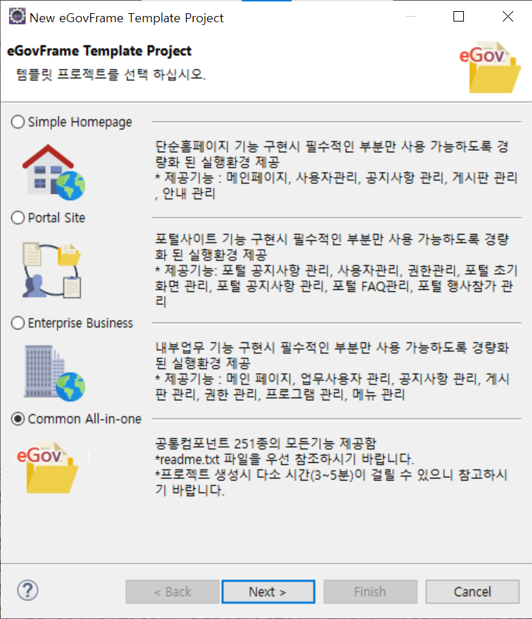

## egovframe 개발 도구 설치
1. 다운로드 -> 개발환경 -> 4.x 다운로드 > 개발자용 개발환경 for Windows 64bit (Implementation Tool) Version 4.3.0 첨부파일 다운받기  
2. eGovFrameDev-4.3.0-64bit.zip 파일 C:\ 에 하위폴더 생성 체크해서 압축해제하기  

```
c:\
  ┗━ eGovFrameDev-4.3.0-64bit
    ┗━ eclipse
    ┗━ workspace-egov
```

## 템플릿 프로젝트 

### 템플릿 프로젝트 생성
1. eclipse -> file -> new -> eGovFrame Template Project -> Common all-in-one 선택  
  

2. project name은 `all`, group Id 는 `com.company` 입력  

3. 환경설정 파일(globals.properties) 파일에서 `Globals.DbType` 을 `oracle`로 변경  

4. tomcat 서버 시작해서 브라우저에서 확인
   - 참조 [공통컴포넌트-> 공통컴포넌트 v4.3 가이드 -> 일반로그인 ](https://www.egovframe.go.kr/wiki/doku.php?id=egovframework:com:v4.3:uat:일반로그인) 

|구분|id|pw|비고|
|:-|:-|:-|:-|
|일반사용자|	USER|	rhdxhd12|	영문으로 공통12|
|기업사용자|	ENTERPRISE|	rhdxhd12|	영문으로 공통12|
|업무사용자|	TEST1|	rhdxhd12|	영문으로 공통12|
|           |webmaster	|rhdxhd12|	영문으로 공통12|


### 데이터베이스 사용자 계정 생성하고 테이블 생성
1. 사용자 계정 생성
```
SQL> 
conn system/oracle
create user com identified by com01;
grant connect, resource, create view to com;
```
2. 테이블 생성  
- script\ddl\oracle\com_DDL_oracle.sql 파일 실행
- script\comment\oracle\egov_oracle_comment.sql 파일 실행
- script\dml\oracle\com_DML_oracle.sql 파일 실행


## mybatis mapper interface 설정

- 참고 : [실행환경 -> 데이터처리 -> MyBatis -> 표준프레임워크 기반 적용 가이드](https://www.egovframe.go.kr/wiki/doku.php?id=egovframework:rte2:psl:dataaccess:mybatisguide)  


### 1. pom.xml 확인
```xml
      <dependency>
		    <groupId>org.egovframe.rte</groupId>
		    <artifactId>org.egovframe.rte.psl.dataaccess</artifactId>
		    <version>${org.egovframe.rte.version}</version>
      </dependency>
```

### 2. context-mapper.xml 설정
MapperConfigurer 빈과 sqlSession 빈 지정합니다.  

MapperConfigurer는 XML 기반 설정 파일을 통해 MyBatis 매퍼들을 스프링 컨테이너에 등록하는 역할.  `basePackage`속성의 `value` 에 `mapper inteface` 경로를 지정
4.3 버전에서 패키지명이 달라짐.  
2.7.0 -> `egovframework`.rte.psl.dataaccess.mapper.MapperConfigurer   
4.3.0 -> `org.egovframe`.rte.psl.dataaccess.mapper.MapperConfigurer  

sqlSession은 JDBC 작업을 수행하는 역할. `mapperLocations` 의 `value`에 `mapper xml`의 경로를 지정. 

```xml
	<!--<alias alias="sqlSession" name="egov.sqlSession" />-->
	<bean id="sqlSession" class="org.mybatis.spring.SqlSessionFactoryBean">
		<property name="dataSource" ref="dataSource" />
		<property name="configLocation" value="classpath:/egovframework/mapper/config/mapper-config.xml" />
		<property name="mapperLocations" value="classpath:/mappers/**/*.xml" />
	</bean>
	
	<bean class="org.egovframe.rte.psl.dataaccess.mapper.MapperConfigurer">
		<property name="basePackage" value="com.yedam.**.impl" />
  </bean>
```


### 3. 매퍼 XML

```xml
<mapper namespace="com.yedam.goods.service.impl.GoodsMapper">
```
### 4. 인터페이스
```
import org.egovframe.rte.psl.dataaccess.mapper.Mapper;
@Mapper("goodsMapper")
public interface GoodsMapper { }
```

### 5. 서비스
```java
@Service("goodsService")
public class GoodsServiceImpl extends EgovAbstractServiceImpl implements GoodsService {
    @Resource(name="goodsMapper")
    private GoodsMapper goodsDAO;
```

## 공통컴포넌트 추가
1. Data Source Explorer 에서 Database Connection 추가
2. File -> New -> eGovFrame common Component ->   


3. 

## validation 


## thymeleaf 설정


## crypto

- 참고 : [실행환경 -> 공통기반 -> Crypto -> crypto 간소화](https://www.egovframe.go.kr/wiki/doku.php?id=egovframework:rte4.3:fdl:crypto)  

### 1. Crypto algorithmKey, algorithmKeyHash 생성
EgovEnvCryptoAlgorithmCreateTest 클래스에서  `algorithmKey` 암호화 키를 지정하고 실행하여   `algorithmKeyHash`를 구한다.  

###  2. algorithmKey 와 algorithmKeyHash를 지정  
src/main/resources에 context-crypto-test.xml 파일을 생성  
`algorithmKey` 와 `algorithmKeyHash`를 지정  

###  3. 데이터베이스 연결항목 암호화  
EgovEnvCryptoUserTest 클래스 파일에서 `userPassword`을 DB 계정 패스워드로 변경하고 실행하여 암호화된 비밀번호를 생성  

###  4. 환경설정 파일 설정  
환경설정 파일(globals.properties) 인코딩 값 설정 `Globals.oracle.Password` 속성에 패스워드 지정  

