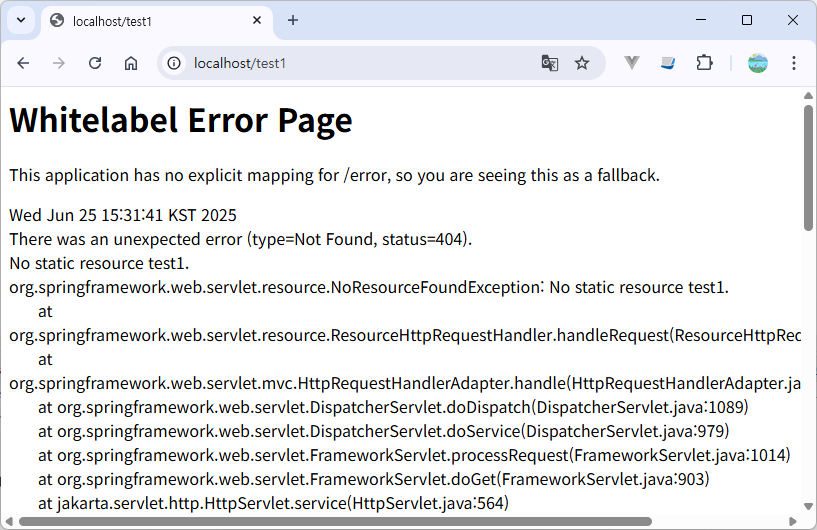
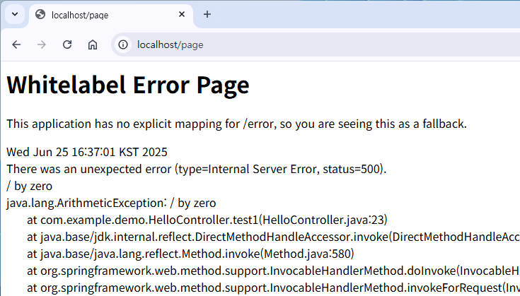
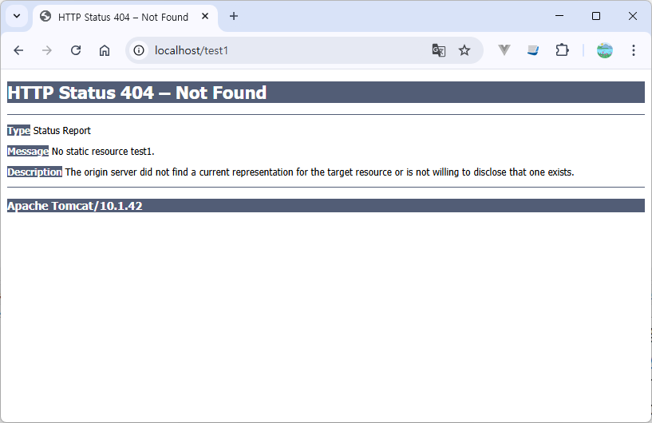
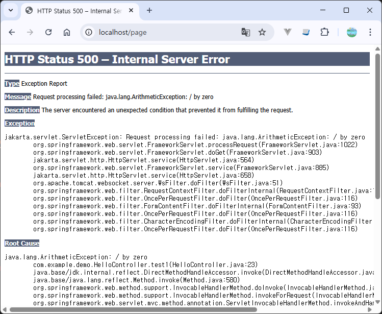
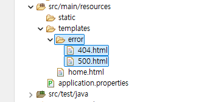

## 스프링부트 에러 처리
- [error-handling](https://docs.spring.io/spring-boot/3.4/reference/web/servlet.html#web.servlet.spring-mvc.error-handling)
- [whitelabel-error-page](https://docs.spring.io/spring-boot/3.4/how-to/spring-mvc.html#howto.spring-mvc.customize-whitelabel-error-page)
- https://soonmin.tistory.com/m/129

### 에러 동작과정
1. 존재하지 않는 API를 호출
2. DispatcherServlet이 해당 URL을 처리할 컨트롤러를 찾지 못함.
3. DispatcherServlet에서 예외 코드를 HttpServletRequest객체에 저장한다.
4. BasicErrorController가 매핑된 /error 앤드포인트로 요청을 전달한다.
5. 헤더의 미디어 타입을 보고, BasicErrorController.errorHtml() 또는 BasicErrorController.error()를 호출한다.
6. HttpServletRequest 객체에서 예외 코드를 확인하여 응답을 처리한다.
7. 커스텀 에러페이지가 있으면 보여주고 없으면 화이트라벨(Whitelabel) 뷰를 보여줌

### springboot whitelabel  

기본적으로 Spring Boot는 모든 오류를 합리적으로 처리하는 /error 매핑을 제공하며, 서블릿 컨테이너에 "전역" 오류 페이지로 등록됩니다. 
`머신 클라이언트`의 경우, 오류 세부 정보, HTTP 상태 및 예외 메시지가 포함된 JSON 응답을 생성합니다. 
`브라우저 클라이언트`의 경우, 동일한 데이터를 HTML 형식으로 렌더링하는 "화이트라벨" 오류 뷰가 있습니다
스프링부트가 자동으로 구성한 기본 오류 핸들러는 'error'뷰를 찾고, 없을 경우 화이트라벨(Whitelabel) 뷰를 사용한다.  

- 브라우저 클라이언트  
 

  
 
- API 클라이언트  
404 에러  

```json
{
  "type": "https://example.org/problems/unknown-project",
  "title": "Unknown project",
  "status": 404,
  "detail": "No project found for id 'spring-unknown'",
  "instance": "/projects/spring-unknown"
}
{
  "error" : "Not Found",
  "message" :  "No static resource xxx",
  "path" : "/api",
  "status" : 404,
  "timestamp" : "2025-06-25T07:26:51.549+00:00",
  "trace" : "org.springframework.web.servlet.resource.NoResourceFoundException: No s..."
}
```

500 에러   

```json
{
  "error" : "Internal Server Error",
  "message" :  "/ by zero",
  "path" : "/api",
  "status" : 500,
  "timestamp" : "2025-06-25T07:26:51.549+00:00",
  "trace" : "java.lang.ArithmeticException: / by zero\r\n\tat com.example.demo.service.impl.SampleServiceImpl.test(SampleServiceImpl.java:13)..."
}
```

### 서블릿 컨테이너 기본 에러 페이지 이용하기
application.properties 파일에서 `server.error.whitelabel.enabled`설정을 하게되면 스프링부트의 기본 오류 페이지를 끄고 사용 중인 서블릿 컨테이너의 기본값이 복원됩니다.

```properties
server.error.whitelabel.enabled=false
```
서블릿 컨테이너 errorpage  



스프링부트의 오류 처리에 대한 프로퍼티 속성  

```properties
server.error.include-exception : 오류 응답에 exception의 내용을 포함할지 여부 (TRUE, FALSE)
server.error.include-stacktrace : 오류 응답에 stacktrace 내용을 포함할지 여부 (ALWAYS, NEVER, ON_TRACE_PARAM)
server.error.path : 오류 응답을 처리할 핸들러(ErrorController)의 path
server.error.whitelabel.enabled : 브라우저 요청에 대해 서버 오류시 기본으로 노출할 페이지를 사용할지 여부 (TRUE, FALSE)
```

###  ‘whitelabel’ 에러페이지 커스터마이징  
error.html 파일은 위의 에러페이지보다 더 높은 우선순위를 가집니다.  

폴더 구조  


에러페이지 오류 속성
```html
    <ul>
        <li th:text="${'오류가 발생했을 때 요청한 URI 경로: ' + path}"></li>
        <li th:text="${'오류발생시간: ' + timestamp}"></li>
        <li th:text="${'http 상태코드: ' + status}"></li>
        <li th:text="${'오류 발생 이유: ' + error}"></li>
        <li th:text="${'예외클래스 이름: ' + exception}"></li>
        <li th:text="${'예외 메시지: ' + message}"></li>
        <li th:text="${'BindingREsult 예외로 발생한 모든 오류: ' + errors}"></li>
        <li th:text="${'예외 스택 트레이스: ' + trace.substring(0,150)}"></li>
    </ul>
```
### 용어
화이트 라벨(White Label): 한 회사가 생산한 제품이나 서비스를 다른 회사가 마치 자체적으로 생산한 것처럼 라벨을 붙여 판매하는 것을 말합니다.    
브라우저 클라이언트는 웹 브라우저를 통해 웹서버에 접속하는 프로그램 또는 장치.  
머신 클라이언트는 서버로부터 서비스를 제공받는 모든 종류의 컴퓨터나 장치를 포괄적으로 지칭.  

### 기타

```html
<%@ taglib uri="http://java.sun.com/jsp/jstl/core" prefix="c" %>
<c:out value="${requestScope['javax.servlet.error.exception']}"/>
```

|에러|내용|
|:-|:-|
|javax.servlet.error.status_code|에러 상태 코드 출력|
|javax.servlet.error.exception_type|예외처리 클래스 출력|
|javax.servlet.error.message|오류 메세지 출력|
|javax.servlet.error.request_uri|문제가 되는 request uri 정보를 출력|
|javax.servlet.error.exception|발생한 예외처리 내용 출력|
|javax.servlet.error.servlet_name|에러가 난 서블릿 명 출력|


```
The 'request','session','servletContext' and 'response' expression utility objects are 
no longer available by default for template expressions and their use is not recommended. 
In cases where they are really needed, they should be manually added as context variables.

===>   직접 model에 넣어서 사용
```