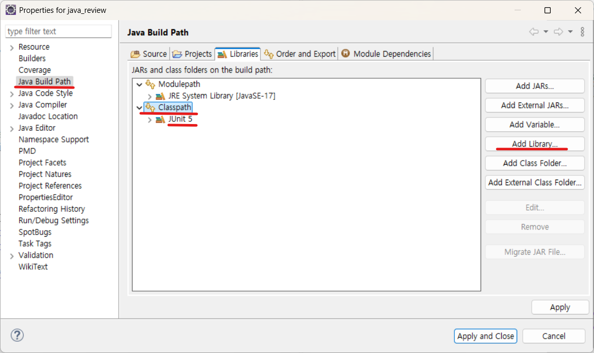

# 스프링 입문 전에 필요한 자바 기초

1. 클래스와 객체
2. 생성자
3. static & 싱글톤
4. 상속과 다형성
5. 인터페이스
6. 인터페이스 & 추상 클래스
7. 캡슐화
8. 예외 처리
9. 컬렉션

## 1. 클래스와 객체

- 클래스: 설계도
- 객체: 실제 인스턴스 (new로 생성)

클래스 선언

```java
package com.yedam;

public class Car {

	String Model;

	void drive() {
		System.out.println("운행중");
	}
}
```

객체(인스턴스) 생성

```java
public class CarTest {

	public static void main(String[] args) {

		Car car = new Car();
		car.drive();
	}
}
```

## 2. 생성자

- 객체 생성 시 자동 호출, 필드 초기화
- 의존성 주입(DI)와 연결

```java

	// 생성자
	public Car(String model) {
		this.model = model;
	}

```

```java
		Car car = new Car("카니발");
```

## 3. static & 싱글톤

- static: 클래스 차원에서 공유
- 싱글톤: 객체 1개만 생성해 공유

```java

	// 1. 자기 자신을 저장할 정적 변수
	private static Car instance;

	// 2. private 생성자 (외부에서 new 금지)
	private Car(String model) {
		this.model = model;
	}

	// 3. 유일한 객체 반환 (필요할 때 생성)
	public static Car getInstance(String model) {
		if (instance == null) {
			instance = new Car(model);
		}
		return instance;
	}
```

```java
  Car car = Car.getInstance("카니발");
```

해시코드를 이용하여 싱글톤 인스턴스 확인

> hashCode는 주소값으로 만든 고유한 숫자값으로 서로다른 두 객체는 같은 해시코드를 가질 수 없다. hashCode 메서드는 객체의 주소값을 이용해서 해싱 기법을 통해 해시코드를 만든 후 반환한다.

> JUnit : 자바에서 표준으로 쓰이는 단위 테스트 프레임워크. assert 메서드로 결과 확인하고 CI/CD 연동가능  
> 

```java
package com.yedam;

import org.junit.jupiter.api.DisplayName;
import org.junit.jupiter.api.Test;

public class CarTest {

	@DisplayName("객체생성")
	@Test
	public void test() {
		Car car1 = new Car("테슬라");
		Car car2 = new Car("테슬라");
		assertEquals(car1, car2);
	}

	@DisplayName("싱글톤")
	@Test
	public void test2() {
		Car car1 = Car.getInstance("카니발");
		Car car2 = Car.getInstance("카니발");
		assertEquals(car1, car2);
	}
}
```

## 4. 상속과 다형성

- 상속: 코드 재사용
- 다형성: 부모 타입으로 자식 객체 사용 가능

```java
Animal a = new Dog(); a.sound();
```

## 5. 인터페이스

- `규격(표준)`을 정하고, 구현체를 바꿔 끼운다.
  - 인터페이스는 “어떤 기능을 꼭 구현해야 한다”라는 규칙을 정함
  - 구현 클래스는 그 규칙을 따라 실제 기능을 작성
  - 인터페이스 타입으로 선언하면, 나중에 구현체를 자유롭게 바꿀 수 있음
- 스프링 DI, 다형성에 활용

```java
public interface Animal {

	//소리내기
	void sound();
}
```

```java
public class Cat implements Animal {

	@Override
	public void sound() {
		System.out.println("야옹~");
	}

}
```

```java
public class Dog implements Animal {

	@Override
	public void sound() {
		System.out.println("멍멍!");
	}

}
```

```java
public class AnimalTest {

	@Test
	public void test() {
        Animal a1 = new Dog();  // Dog 객체를 인터페이스 타입으로 참조
        Animal a2 = new Cat();  // Cat 객체를 인터페이스 타입으로 참조

        a1.sound(); // 멍멍!
        a2.sound(); // 야옹~
	}
}

```

## 6. 인터페이스 & 추상 클래스

- 추상 클래스: 일부 구현 + 공통 기능 제공
- 인터페이스: 규격만 정의
- 스프링은 인터페이스 기반 설계 선호

## 7. 캡슐화

- 필드는 private
- 접근은 getter/setter

## 8. 예외 처리

- 프로그램 안정성 보장
- try-catch, throws 활용

## 9. 컬렉션(List, Map)

- List
  - 순서(인덱스)가 있는 자료구조
  - 중복 데이터 허용
    . Set
  - 순서(인덱스) 없음
  - 중복 허용하지 않음
- Map
  - Key-Value 쌍으로 저장
  - Key는 중복 불가, Value는 중복 가능

```java
List<String> list = new ArrayList<>();

        list.add("Java");
        list.add("Spring");
        list.add("Java"); // 중복 허용
        list.add("Vue");
```

```java
Set<String> set = new HashSet<>();

        set.add("Java");
        set.add("Spring");
        set.add("Java"); // 중복 무시
        set.add("Vue");
```

```java
Map<Integer, String> map = new HashMap<>();

        map.put(1, "Java");
        map.put(2, "Spring");
        map.put(3, "Vue");
        map.put(1, "Python");
```
